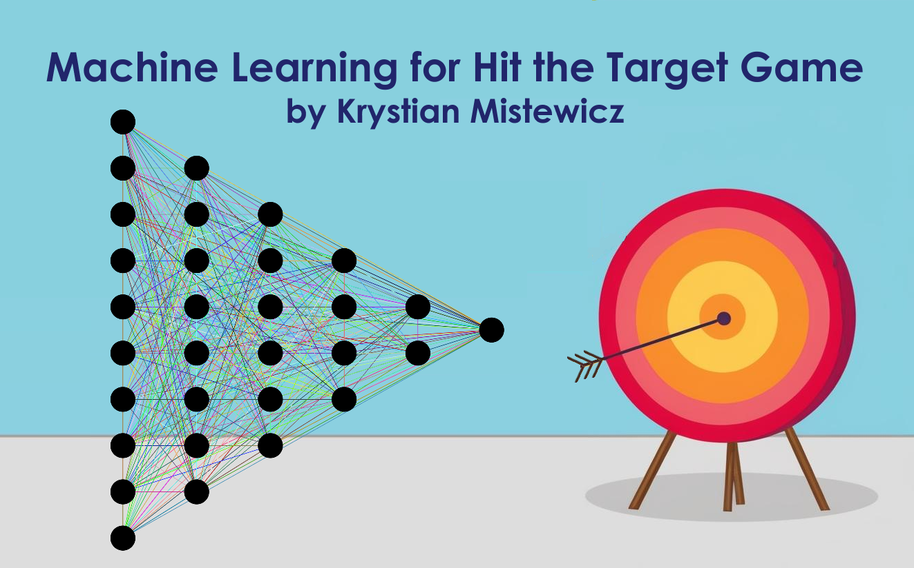
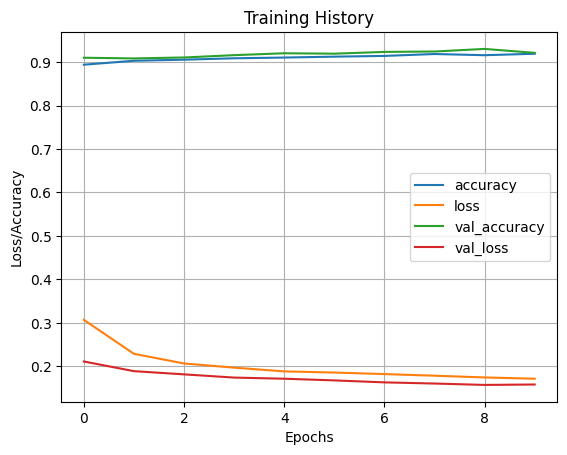
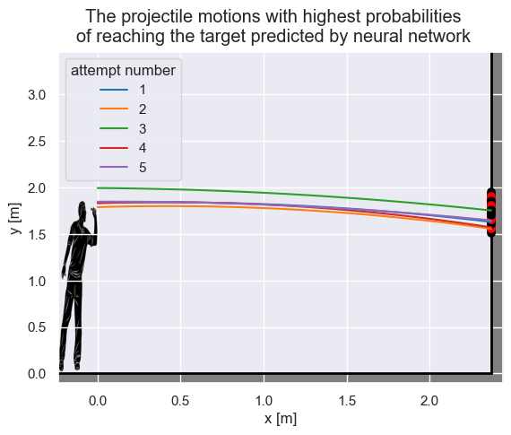

# Hit Target Game - Machine Learning Project

## ⭐ Support the Project
If you find this project helpful, please consider **starring the repository**!  
👉 It helps more people discover the project and keeps motivation high 💡  

## 📖 About Project
This project demonstrates the use of machine learning to solve a physics-based problem: determining the correct parameters (initial height, velocity, and angle) for a projectile to hit a target. The project involves generating synthetic data, training a neural network model, and using the model to predict optimal solutions.

## Key Steps in the Project:
1. **Data Generation**:
    - Synthetic data is generated using the `HitTargetGame` class, which simulates projectile motion with varying parameters such as target distance, height, diameter, initial height, velocity, and angle.

2. **Data Preparation**:
    - The generated data is divided into features (`X`) and target variable (`y`), and further split into training and testing datasets.

3. **Model Creation and Training**:
    - A neural network model is created using TensorFlow/Keras. The model is trained to predict whether the projectile will hit the target based on the input parameters.

4. **Model Evaluation**:
    - The model's performance is evaluated using test data, and metrics such as loss and accuracy are calculated.

5. **Prediction and Visualization**:
    - The trained model is used to predict the best parameters for hitting a target with given specifications (distance, height, and diameter).
    - The results are visualized using a graphical representation of the projectile motion and the target.

## Libraries and Tools Used:
- `pandas` for data manipulation and analysis.
- `matplotlib` for data visualization.
- `scikit-learn` for data splitting.
- `tensorflow` for building and training the neural network.
- Custom modules (`HitTargetGame`, `ProjectileMotion`, `Graph`) for physics simulation and visualization.

This project combines physics, machine learning, and data visualization to solve a practical problem in an interactive and educational way.

⭐ **If you find this project useful, please consider giving it a star!**
